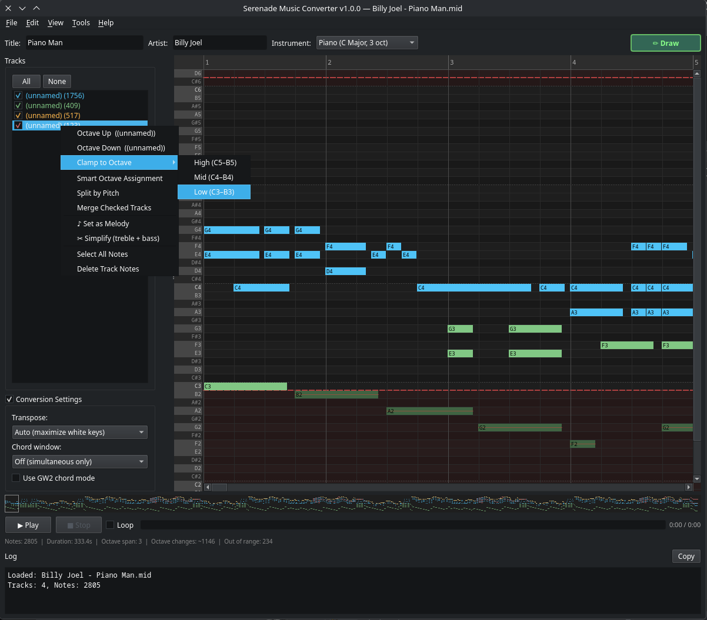

# Serenade Music Converter

A GUI tool for converting MIDI files to AHK (AutoHotkey) scripts compatible with the [Serenade](https://github.com/PieOrCake/serenade) addon for Guild Wars 2.

  



## Features

- **Piano Roll Editor** — visual note editing with drag, draw, resize, copy/paste, undo/redo
- **Multi-track support** — load MIDI files with multiple tracks, toggle visibility, set melody track
- **Per-track simplification** — reduce chord complexity by keeping only treble + bass notes (✂)
- **GW2 instrument mapping** — supports all GW2 instruments (Harp, Lute, Horn, Bell, Flute, Bass, etc.)
- **Chord mode** — detects major/minor triads and substitutes GW2 chord keypresses
- **Analyse & Auto-fix** — one-click analysis detects octave issues, dense chords, timing problems; auto-fix with melody-priority octave shifting, harmonic substitution, octave consolidation, cross-octave cleanup, and density-adaptive thinning
- **Preserve track** — protect important accompaniment tracks from destructive auto-fix passes
- **Smart octave detection** — auto-transpose minimizes octave changes; optional octave smoothing
- **Octave settle delays** — 60ms per-step delays in AHK output for reliable GW2 octave switching
- **Audio preview** — Play, Play Here, Stop, and loop controls with synthesized playback
- **AHK import** — load existing AHK scripts back into the piano roll for editing
- **MusicXML import/export** — interoperate with notation software
- **Drag & drop** — drop MIDI, MusicXML, or AHK files onto the window to load
- **Batch conversion** — convert multiple MIDI files at once
- **Song submission** — submit your arrangements to the community song index
- **Dark / Light themes** — switchable UI themes

## Installation

### Using an AppImage Manager (recommended)
1. Install [Gear Lever](https://flathub.org/apps/it.mijorus.gearlever) from Flathub
2. Download the latest `.AppImage` from [Releases](https://github.com/PieOrCake/serenade-converter/releases)
3. Right-click the downloaded file and select Open With → Gear Lever

Gear Lever will integrate the app into your desktop — no terminal needed.

### Manual (terminal)
Download the latest `.AppImage` from [Releases](https://github.com/PieOrCake/serenade-converter/releases), then:

```bash
chmod +x Serenade_Music_Converter-x86_64.AppImage
./Serenade_Music_Converter-x86_64.AppImage
```

### Windows
Download `Serenade.Music.Converter.exe` from [Releases](https://github.com/PieOrCake/serenade-converter/releases) and run it directly. No installation required.

## Documentation

See the [Wiki](https://github.com/PieOrCake/serenade-converter/wiki) for the full user guide:

- [Getting Started](https://github.com/PieOrCake/serenade-converter/wiki/Getting-Started)
- [Piano Roll Editing](https://github.com/PieOrCake/serenade-converter/wiki/Piano-Roll-Editing)
- [Track Management](https://github.com/PieOrCake/serenade-converter/wiki/Track-Management)
- [Analyse & Auto-Fix](https://github.com/PieOrCake/serenade-converter/wiki/Analyse-and-Auto-Fix)
- [Chord Simplification](https://github.com/PieOrCake/serenade-converter/wiki/Chord-Simplification)
- [Conversion Settings](https://github.com/PieOrCake/serenade-converter/wiki/Conversion-Settings)
- [Playback](https://github.com/PieOrCake/serenade-converter/wiki/Playback)
- [Keyboard Shortcuts](https://github.com/PieOrCake/serenade-converter/wiki/Keyboard-Shortcuts)
- [Building from Source](https://github.com/PieOrCake/serenade-converter/wiki/Building-from-Source)

## License

This project is licensed under the [GNU General Public License v3.0](LICENSE).

## Third-Party Dependencies

| Library | License | Link |
|---|---|---|
| [PyQt6](https://pypi.org/project/PyQt6/) | GPL v3 | [Riverbank Computing](https://riverbankcomputing.com/software/pyqt/) |
| [Qt 6](https://www.qt.io/) | LGPL v3 / GPL v3 | [qt.io](https://www.qt.io/licensing/) |
| [mido](https://pypi.org/project/mido/) | MIT | [GitHub](https://github.com/mido/mido) |
| [pygame](https://pypi.org/project/pygame/) | LGPL v2.1 | [pygame.org](https://www.pygame.org/) |
| [NumPy](https://pypi.org/project/numpy/) | BSD 3-Clause | [numpy.org](https://numpy.org/) |
| [PyInstaller](https://pypi.org/project/pyinstaller/) | GPL v2 (with bootloader exception) | [GitHub](https://github.com/pyinstaller/pyinstaller) |
