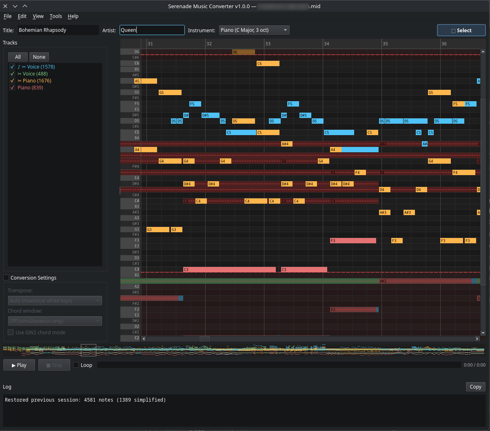

# Chord Simplification

GW2 instruments can only play a limited number of simultaneous notes. Complex MIDI arrangements often have dense chords that sound muddy or cause note drops in-game. **Chord simplification** reduces chord complexity by keeping only the essential notes.

## How It Works

When simplification is enabled on a track, the converter analyzes chord groups (notes starting within 5ms of each other) within that track:

- **3+ simultaneous notes** → keeps the **highest** (treble) and **lowest** (bass/root) notes, marks the middle notes as simplified
- **2 or fewer notes** → left untouched

This preserves the harmonic character of the music (melody on top, bass on bottom) while removing the less important inner voicing.

## Enabling Simplification

Right-click a track in the track list and choose **✂ Simplify (treble + bass)**. The track will show a ✂ prefix in the track list.

To disable, right-click again and choose **✂ Clear Simplify**.

## Visual Feedback

Simplified notes are shown as **dimmed** with a dashed strikethrough on the piano roll. They remain visible so you can see what was removed, but they are excluded from conversion and playback.

In the screenshot above, the Voice and Piano tracks have simplification enabled (✂ prefix). The log shows "4581 notes (1389 simplified)" — nearly a third of the notes were simplified away, resulting in a cleaner arrangement.

## Manual Overrides

You can manually override the simplification decision for individual notes:

- **Ctrl+Shift+Click** on a simplified (dimmed) note → forces it to be **kept** (un-simplified)
- **Ctrl+Shift+Click** on a kept note → forces it to be **simplified** (dimmed)
- **Ctrl+Shift+Click** again → clears the manual override (returns to auto)

Manual overrides are shown by the note returning to its normal or dimmed state. They persist across sessions and are cleared if you disable simplification on the track.

## Melody Priority

When a [melody track](Track-Management#melody-track) is set, an additional simplification pass runs automatically: notes on non-melody tracks that share a pitch class with a simultaneous melody note but are in a lower octave are hidden. This prevents bass doublings from muddying the melody while preserving harmonic fill notes. See [Track Management — Melody Track](Track-Management#melody-track) for details.

Melody priority and per-track chord simplification work together — both passes run in sequence, and manual overrides apply to either.

## Tips

- Simplification works best on tracks with dense chords (orchestral arrangements, piano pieces with full voicing)
- You can simplify multiple tracks independently — each track is processed on its own
- Use simplification together with track visibility to build a clean arrangement: hide tracks you don't need, simplify tracks that are too busy
- Combine **✂ Simplify** with **♪ Melody** for best results: simplify reduces chord density, melody priority clears bass doublings
- The status bar shows the total note count after simplification, so you can gauge the effect
