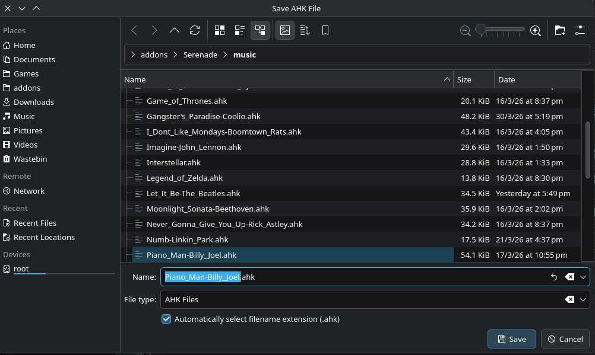

# Getting Started

## Installation

Download the latest AppImage from the [Releases](https://github.com/PieOrCake/serenade-converter/releases) page. No installation is required — the AppImage bundles everything.

```bash
chmod +x Serenade_Music_Converter-x86_64.AppImage
./Serenade_Music_Converter-x86_64.AppImage
```

## Loading a File

Use **File → Import File** (Ctrl+O) to open a music file. Supported formats:

| Format | Extensions | Notes |
|---|---|---|
| MIDI | `.mid`, `.midi` | Most common source format |
| MusicXML | `.musicxml`, `.mxl` | From notation software (MuseScore, Finale, etc.) |
| AHK | `.ahk` | Re-import a previously exported Serenade script |

The converter will automatically:
- Extract track information and display notes on the piano roll
- Detect title and artist from the file metadata
- Select the best instrument range and transpose setting

You can also **drag and drop** a file onto the window, or use **File → Recent Files** to reopen a previous file.

## The Main Window


The interface has these main areas:

- **Menu bar** — File, Edit, View, Tools, Help
- **Title / Artist / Instrument** — metadata fields at the top
- **Track list** (left) — shows all tracks with visibility checkboxes; right-click for track tools
- **Piano roll** (center) — visual note editor; scroll, zoom, select, draw, and edit notes
- **Conversion Settings** (bottom-left) — transpose, chord window, and chord mode options
- **Minimap** — song overview below the piano roll; click to scroll, shows playback cursor
- **Playback controls** (bottom) — Play, Here, Stop, Loop, and a time display
- **Status bar** — note count, duration, octave span, octave changes, out-of-range count
- **Log panel** (bottom) — shows messages, conversion output, and errors

## Basic Workflow

1. **Load** a MIDI file
2. **Review tracks** — toggle visibility, set a melody track if desired
3. **Edit notes** — select and move, delete unwanted notes, draw new ones
4. **Simplify** — right-click a busy track and choose "✂ Simplify (treble + bass)" to reduce chord complexity
5. **Preview** — click Play to hear the arrangement
6. **Export** — File → Save AHK (Ctrl+S) to save the script



The save dialog suggests a filename based on the title and artist fields. The AHK file is saved to your chosen directory and is ready to use with the Serenade addon in GW2.

## Session Persistence

Your editing state is automatically saved when you close the app and restored when you reopen it. This includes all notes, track settings (including simplification), scroll position, and zoom level.
