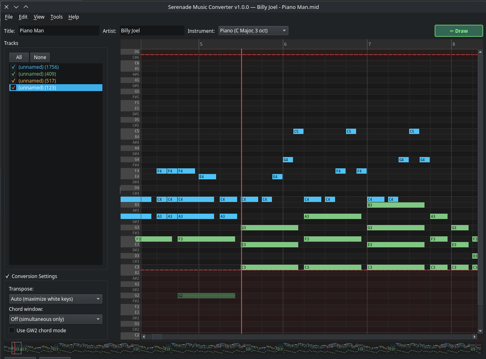

# Playback

The converter includes a built-in audio preview so you can hear your arrangement before exporting.

## Controls

- **Play** — starts playback from the beginning (or from a selection/range)
- **Here** — starts playback from the current view position in the piano roll
- **Stop** — stops playback
- **Loop** — when checked, playback restarts automatically when it reaches the end
- **Space** — keyboard shortcut to toggle play/pause

The current playback position is shown as a **red vertical cursor** on the piano roll and the **minimap** below it. The time display shows elapsed / total time.

## What You Hear

Playback uses synthesized audio (pygame) to approximate how the song will sound. It respects:

- **Track visibility** — hidden tracks are not played
- **Simplified notes** — notes marked as simplified (✂) are skipped
- **GW2 pitch range** — notes are mapped to the selected instrument's range

This gives you a realistic preview of what will actually play in-game.

## Range Playback

If you have a **range selected** on the ruler (click and drag on the measure bar), playback will only play notes within that range. This is useful for previewing a specific section.

## Tips

- Use playback after simplifying tracks to hear the difference
- Toggle individual tracks on/off during playback to isolate parts
- The Loop checkbox is useful for fine-tuning a section
